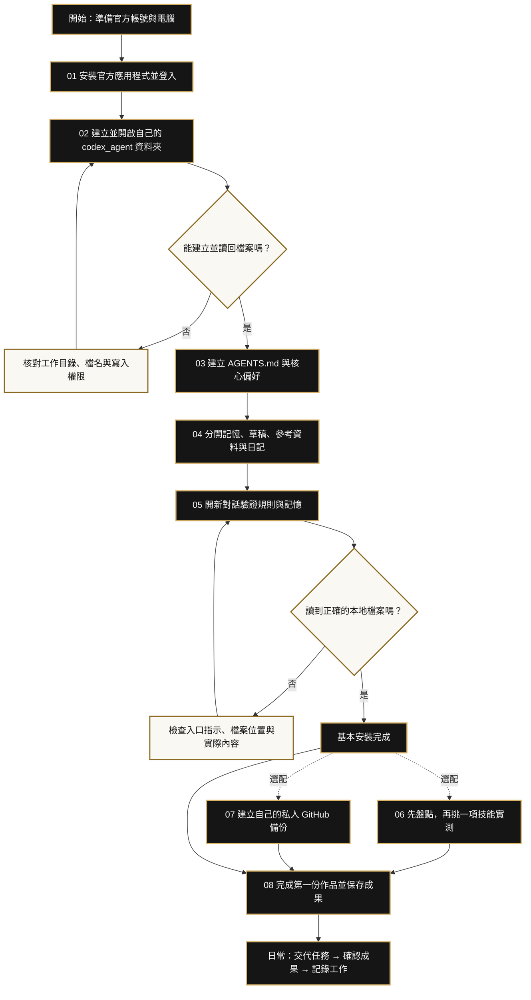

# Codex Agent 安裝流程圖

[回到入口](README.md) · [開啟逐步教學](GUIDE.md)

實線是基本路線；技能與 GitHub 是完成基本驗證後的選配。

## 看不到圖時

部分 Markdown 閱讀器不支援 Mermaid。可回到 GitHub 看本頁，或直接使用下面文字流程：

1. 安裝、登入 → 開啟自己的資料夾。
2. 寫入測試失敗 → 先修正路徑或權限；成功才往下。
3. 建立規則 → 整理資料夾 → 開新對話驗證。
4. 沒讀到 → 修正入口與路徑；讀到代表基本安裝完成。
5. 有需要才加技能、設定私人備份。
6. 完成第一件工作 → 存檔 → 記錄 → 下次接續。

下載本頁的 `.md` 即保留可編輯流程圖原始碼，不需要另外購買繪圖工具。
